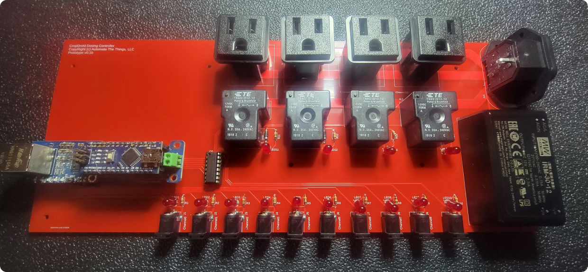
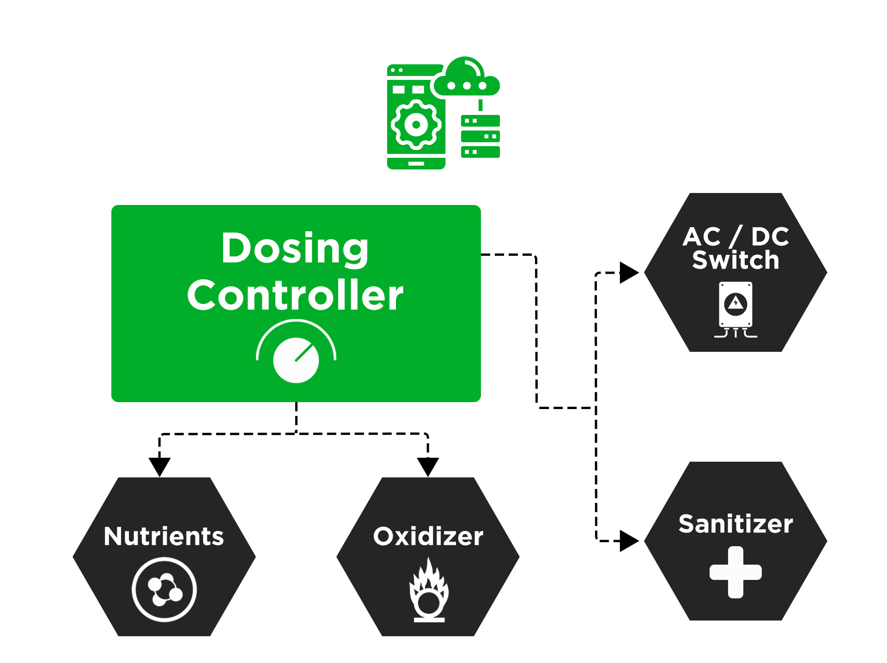
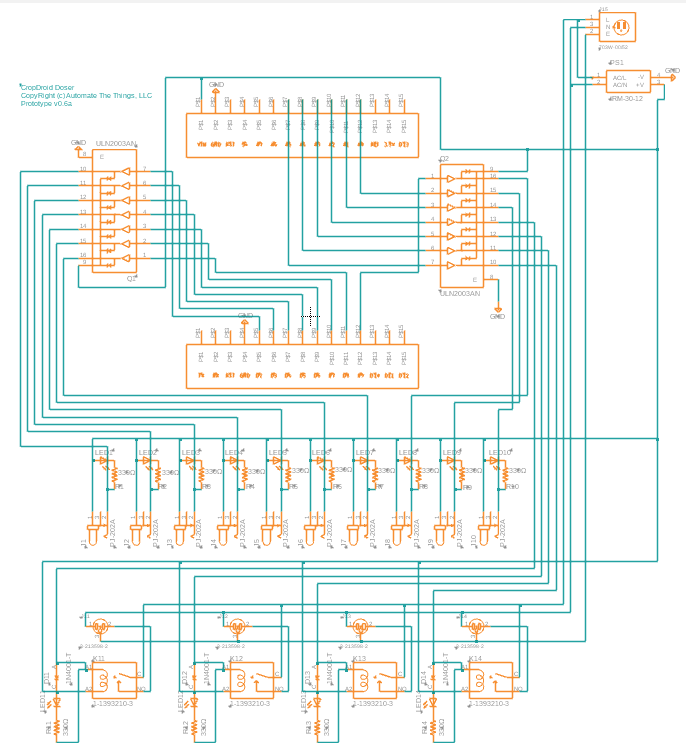
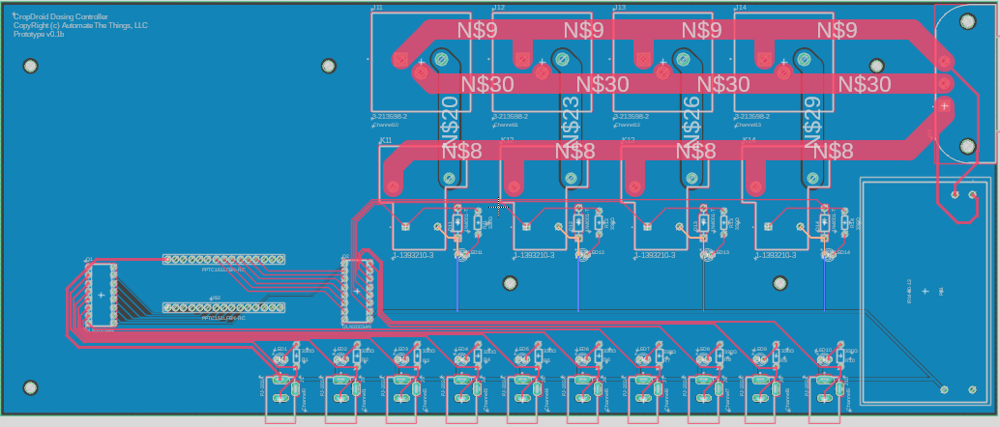
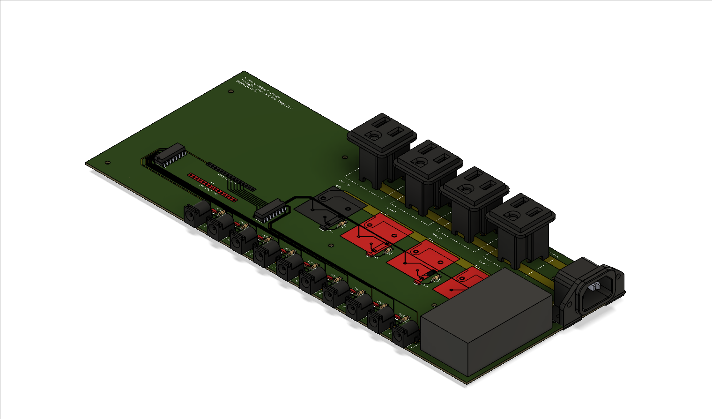
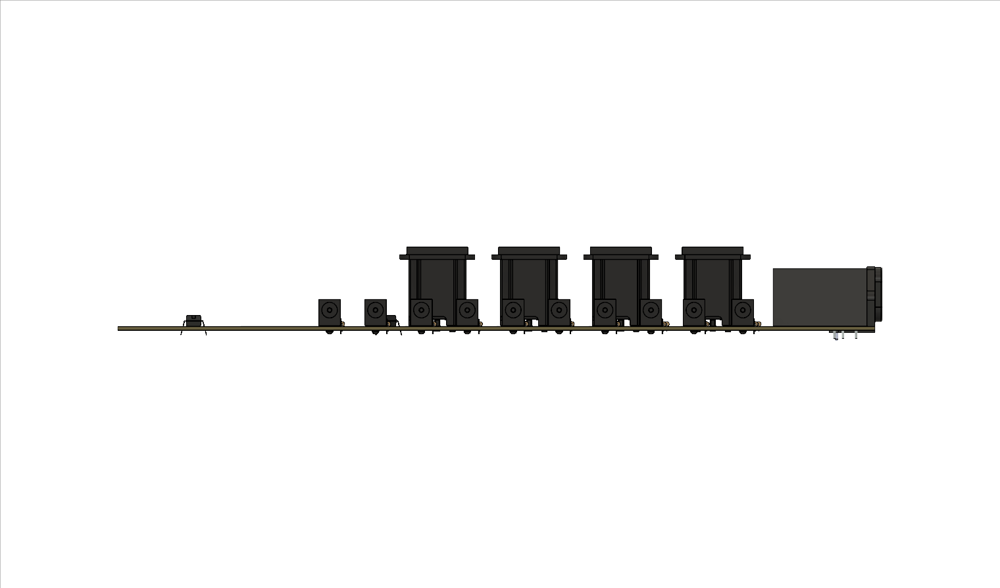
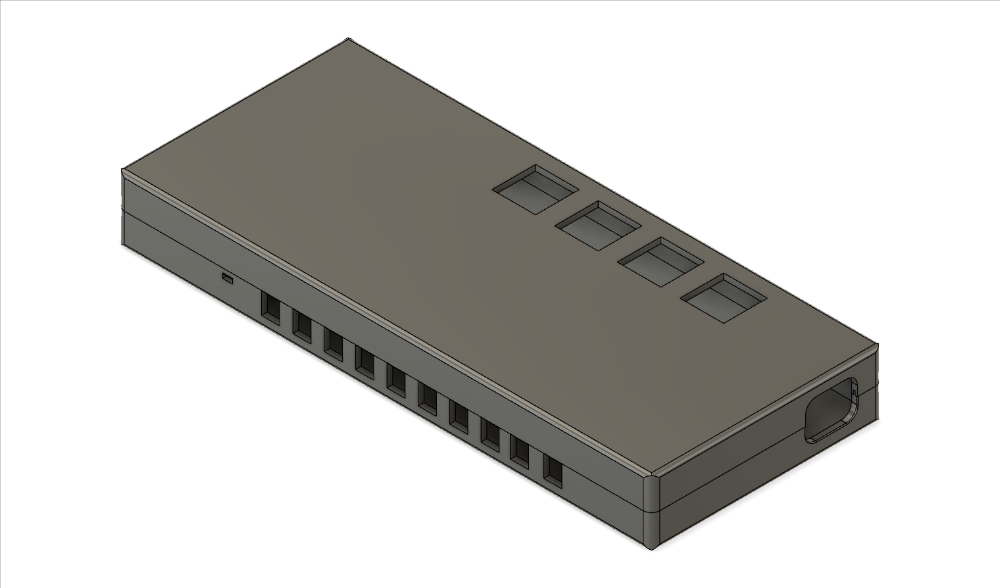
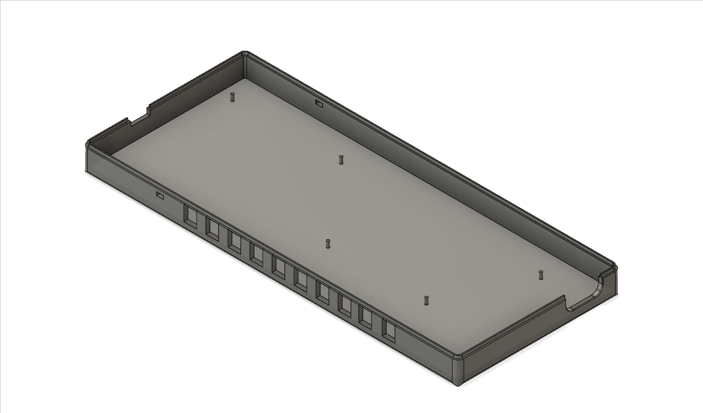

# cropdroid-doser

Dosing / nutrient controller for the CropDroid automation system.

# PIN Usage

## Usable

Dosing pumps can be operated on digital pins 02, 03, 05, 06, 07, 08, 09.

## Reserved

#### Serial

Arduino communicates over serial using digital pins 00 (RX) and 01 (TX).

#### Ethernet

Arduino communicates with both the W5100 and SD card using the SPI bus (through the ICSP header).

On all boards, pin 10 is used to select the W5100 and pin 4 for the SD card. 

##### Nano / Uno
Digital pins 10, 11, 12, and 13.

##### Meta
Digital pins 50, 51, and 52. 

## Support

Please consider supporting this project for ongoing success and sustainability. I'm a passionate open source contributor making a professional living creating free, secure, scalable, robust, enterprise grade, distributed systems and cloud native solutions.

I'm also available for international consulting opportunities. Please let me know how I can assist you or your organization in achieving your desired security posture and technology goals.

https://github.com/sponsors/jeremyhahn

https://www.linkedin.com/in/jeremyhahn
